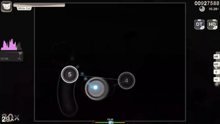

# OSU

A collection of scripts to train neural networks to play the rhythm game osu!

## Goal
The goal of this project is not necessarily to train a neural network to surpass humans in osu!, but
to have the neural network generate human-like play data, as that is personally more interesting to me. 
Playing back the generated data in-game is secondary, though it has been implemented (in gui.py).  

### Credits
This entire project is largely inspired by (and uses a lot of beatmap processing code from) [this repository](https://github.com/GuiBrandt/OsuLearn).

[WGAN paper with gradient penalty](https://arxiv.org/abs/1704.00028)

[Adversarial VAE](https://arxiv.org/abs/2012.11551)

# Models
This repo implements the following models, ranked from worst performing to best

## LSTM-based RNN (Recurrent Neural Network)
Performed very well in-game, but deterministic and very robotic, which isn't the goal. It turned out to be
*way* too good at the game.  
  
<sub>The RNN playing Logical Stimulus, a known difficult map with all difficulty modifiers</sub>

## GAN (Generative Adversarial Network)
Ended up performing like the aforementioned RNN, due to mode collapse and the 
discriminator defaulting to 0.  

## VAE (Variational Autoencoder)
Performed very well in terms of the trajectory
between notes, and in one rare case, learned to generate realistic spinner movement
and idle movements. Cannot consistently learn spinner/idle patterns, and has a (known) tendency
to average out movement patterns.  
  
<sub>The VAE playing through a spinner. Many more examples [here](https://www.youtube.com/watch?v=lKOraHbxjHo&t=5s)</sub>

# Keypress models
There are also models for generating keypresses, alongside the ones that
generate cursor movement. They are separated for simplicity and ease of training. There's only
one at the moment:

## LSTM-based RNN
Works fine, but sometimes will tap twice for trickier sequences.  

### WIP
More models are still being implemented, including a WGAN with gradient penalty, and an adversarially
trained VAE. 

**Model weights will be made public soon, along with datasets.**  

# Replay playback (and running locally)
The `gui.py` script functions as a utility GUI to generate and playback replays in-game.
**Note: This is not intended as a cheat, you may get banned if using this with a ranked account.**

The environment is managed by [uv](https://docs.astral.sh/uv/getting-started/).  
To setup the environment:
```
uv sync
```

To run a python script:
```
uv run [path_to_script]
```
