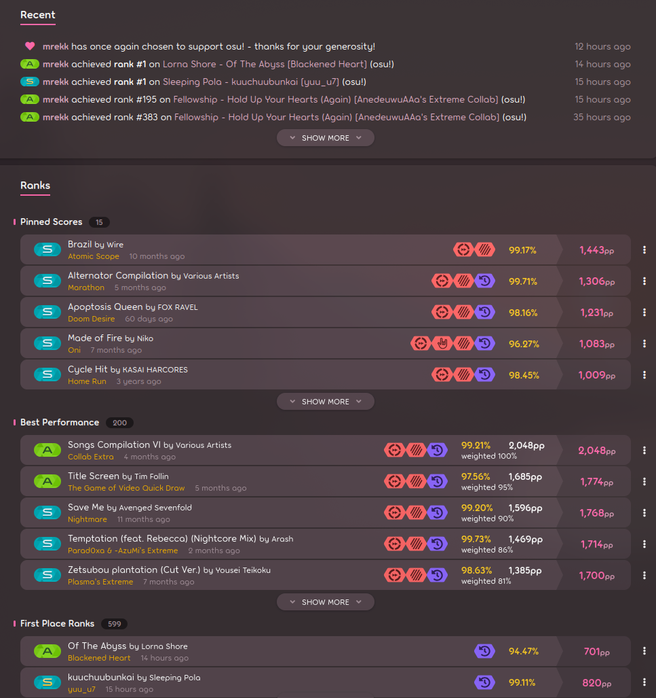

# Improvements
Some major improvements were made in the time of me writing this:

- The model learned how to spin
- The model learned idle cursor movement

Major improvements:
- Switch to VAE
- Feed the VAE sliding window of frames, instead of the current one only
- KL annealing
- Training data gathered from **one person**


blah blah etc.  

## Data
One of the major improvements was selecting a _single user's_ plays to train on.  
However, the amount of data quickly becomes a problem.  At this point, I had ~35k saved replays on my disk (from scraping
the top 50 replays for every map I had), but the largest amount of replays from any single player
was at most ~150. 

This really sucks, as our previous dataset was composed of upwards to 7.5k replays, and a downgrade to 150 would be massively
under-representing the variety of patterns that can occur in osu!. Luckily, osu!'s API exposes an endpoint for
fetching a specific player's featured scores:

```py
endpoint = f"https://osu.ppy.sh/users/{user_id}/scores/{score_type}?mode=osu"

# where
score_type = "recent" | "best" | "firsts" | "pinned"
```

If you've played osu! before, you'd notice that the score types are exactly the sections 
you'd see on someone's profile:



After scraping these plays, I ended up with 650 replays from the current top 1 player, [mrekk](https://osu.ppy.sh/users/7562902). 
Still not great, but workable for now.  

## Results
BLEH

## More data
Now that we see results from training on a single player, it's time to expand our dataset. 
To download a replay from osu!, we need the score id, and for the corresponding map it's 'mapset' id, so we're gonna need to find those. 

After a bit of digging, I found out that osu! does a monthly data dump of the top 10,000 players [here](https://data.ppy.sh/). Downloading and extracting one of the tarballs:
```sh
tree
.
├── osu_beatmap_difficulty.sql
├── osu_beatmap_difficulty_attribs.sql
├── osu_beatmap_failtimes.sql
├── osu_beatmap_performance_blacklist.sql
├── osu_beatmaps.sql
├── osu_beatmapsets.sql
├── osu_counts.sql
├── osu_difficulty_attribs.sql
├── osu_scores_high.sql
├── osu_user_beatmap_playcount.sql
├── osu_user_stats.sql
├── sample_users.sql
└── scores.sql
```

Great! We now have a bunch of MySQL dumps that we can possibly query for some score ids. Specifically, `scores.sql`  looks promising. 
Let's see how many scores are stored here:
```mysql
SELECT COUNT(*) FROM scores;
    
+----------+
| COUNT(*) |
+----------+
|  6494861 |
+----------+
1 row in set (3.282 sec)
```

6494861 scores, very cool. Filtering out the ones we're interested in:
```mysql
-- 7562902 is mrekk's user id, and we only want the ones 
-- with above 90 acc and a replay, and only if it was after 2021
SELECT COUNT(*) FROM scores WHERE user_id = 7562902 AND accuracy > 0.9 AND has_replay = 1 AND preserve = 1 AND ended_at > '2021-01-01';
    
+----------+
| COUNT(*) |
+----------+
|     3666 |
+----------+
1 row in set (0.000 sec)
```

3666 is plenty of data for us to work with.  Unfortunately, the mapset id isn't present in the scores table, just the beatmap_id:
```mysql
SHOW COLUMNS FROM scores;

+--------------------+-----------------------+------+-----+------------------+----------------+
| Field              | Type                  | Null | Key | Default          | Extra          |
+--------------------+-----------------------+------+-----+------------------+----------------+
| id                 | bigint(20) unsigned   | NO   | PRI | NULL             | auto_increment |
| user_id            | int(10) unsigned      | NO   | MUL | NULL             |                |
| ruleset_id         | smallint(5) unsigned  | NO   | MUL | NULL             |                |
| beatmap_id         | mediumint(8) unsigned | NO   | MUL | NULL             |                |
| has_replay         | tinyint(1)            | NO   |     | 0                |                |
| preserve           | tinyint(1)            | NO   | PRI | 0                |                |
| ranked             | tinyint(1)            | NO   |     | 1                |                |
| rank               | char(2)               | NO   |     |                  |                |
| passed             | tinyint(4)            | NO   |     | 0                |                |
| accuracy           | float                 | NO   |     | 0                |                |
| max_combo          | int(10) unsigned      | YES  |     | 0                |                |
| total_score        | int(10) unsigned      | NO   |     | 0                |                |
| data               | longtext              | NO   |     | NULL             |                |
| pp                 | float unsigned        | YES  |     | NULL             |                |
| legacy_score_id    | bigint(20) unsigned   | YES  |     | NULL             |                |
| legacy_total_score | int(10) unsigned      | NO   |     | 0                |                |
| started_at         | timestamp             | YES  |     | NULL             |                |
| ended_at           | timestamp             | NO   |     | NULL             |                |
| unix_updated_at    | int(10) unsigned      | NO   | PRI | unix_timestamp() |                |
| build_id           | smallint(5) unsigned  | YES  |     | NULL             |                |
+--------------------+-----------------------+------+-----+------------------+----------------+
20 rows in set (0.001 sec)
```

Luckily, we can query the osu_beatmaps table for the corresponding ids like so:
```mysql
SELECT beatmap_id, beatmapset_id FROM osu_beatmaps WHERE beatmap_id IN ( 
    SELECT DISTINCT beatmap_id FROM scores      
        WHERE user_id = 7562902 AND accuracy > 0.9 
          AND has_replay = 1 AND preserve = 1) LIMIT 10;
    
+------------+---------------+
| beatmap_id | beatmapset_id |
+------------+---------------+
|     523376 |        224164 |
|     544419 |        234785 |
|     544420 |        234785 |
|     561335 |        243337 |
|     580941 |        252981 |
|     588523 |        256947 |
|     591347 |        258585 |
|     641169 |        283595 |
|     646087 |        286145 |
|     660247 |        280795 |
+------------+---------------+
10 rows in set (0.000 sec)
```

Finally, let's write a CSV onto disk containing the information we need, so we can return to python:
```mysql
(SELECT 'id', 'user_id', 'beatmap_id', 'has_replay', 'preserve', 
        'ranked', 'rank', 'passed', 'accuracy', 'max_combo', 
        'total_score', 'ended_at', 'pp', 'beatmapset_id')
UNION ALL
(SELECT s.id, s.user_id, s.beatmap_id, s.has_replay, s.preserve, 
        s.ranked, s.rank, s.passed, s.accuracy, s.max_combo, 
        s.total_score, s.ended_at, s.pp, b.beatmapset_id
FROM scores s
LEFT JOIN osu_beatmaps b ON s.beatmap_id = b.beatmap_id
WHERE s.has_replay = 1 
  AND s.preserve = 1 
  AND s.ended_at > '2018-01-01')
INTO OUTFILE '/tmp/all_scores.csv' 
FIELDS TERMINATED BY ',' 
ENCLOSED BY '"' 
LINES TERMINATED BY '\n';

Query OK, 2707204 rows affected (31.477 sec)
```

## More results
...