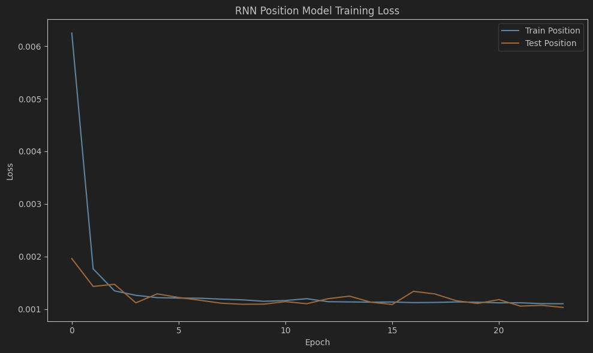
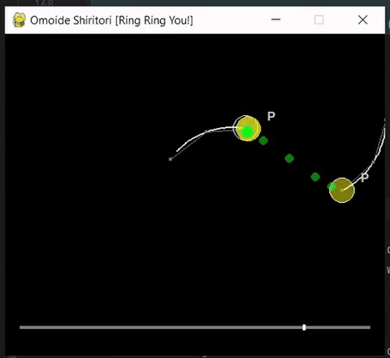
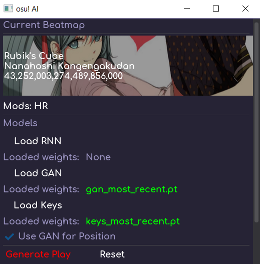
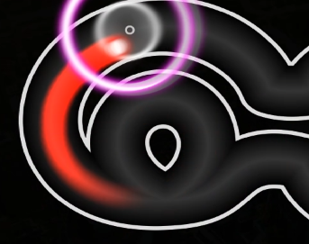
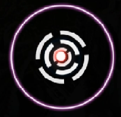
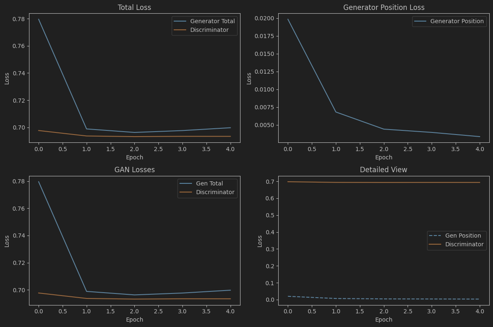

# osu! AI

Yeah osu neural network time..  

Inspired largely by [Guilherme Brandt's](https://github.com/GuiBrandt/OsuLearn) project! Most of the parsing and ruleset
code was straight from his repository, as well as many architectural ideas and the pygame preview stuff,
so big thanks to him.  

P.S. I am relatively new to machine learning so if I get some things wrong please correct me

### Background
If you're reading this, chances are you know what osu! is. If you don't,
here's a quick summary:

osu! is a rhythm game where you move your cursor and
click circles to the beat.


<sub>Gameplay from Chamqp</sub>

There's **three** types of hit-objects (notes) in osu:
- **Circle**: Click the circle when the outer ring (known as the **approach circle**) closes in on it.  
- **Slider**: Same thing as the circle, but **press and hold** while following the slider along a predetermined track.
- **Spinner**: Spin in a circle as fast as you can.  

There's also **mods** that change up the gameplay, in return for a higher/lower score. There's
a lot of them, but we'll only concern ourselves with two for now: 
- **Hard Rock (HR)**: Makes the size of hit-objects smaller, decreases hit window, increases approach rate, and flips 
the playing ground vertically. 
- **Double Time (DT)**: Speeds up the gameplay by **1.5x** (not 2x lol). 

I call refer to these mods as "gameplay affecting", because a lot of mods are either **non-ranked**
(your score won't get uploaded to osu's servers), or they don't affect the features we need (such as the **hidden** mod,
which removes approach circles from the player's view, and **flashlight**, which hides all objects that are far away 
from your cursor).  

### The goal?
Create a neural network capable of spitting out human-like replay data given a map.

Keyword: **human-like**. Training a perfectly playing neural network is trivial, given the nature of the game.
We don't even have to write a neural network at all to achieve perfect plays.
But we're not here to make Auto v2.

### Input features

We need to decide on input and output features (what should our NN know about the game, and what should it generate?)

A beatmap is essentially a time series of hit-objects and **timing points** (points in the map where the bpm/speed changes).
Knowing this, a reasonable set of input features, starting out, could look something like this: 
```python
[
    'x', 
    'y', 
    'time_until_hit', 
    'is_slider', # binary 1 or 0
    'is_spinner',
    'circle_size',
    'slider_speed',
    'slider_len'
]
```

Where:  
- `x, y` are the coordinates of the *next* hit-object (or the *current* slider's follow point) normalized to the range `[-0.5, 0.5]`,
- `time_until_hit` is the amount of seconds until the approach circle fully closes in on the hit-object. 
- `circle_size` is how large the hit-object is, in the range `[0, 1]` where a smaller value represents a larger radius.
- `slider_speed` is how fast the follow point on the slider travels, in px/sec.  
- `slider_length` is how long the slider is in pixels divided by 600.

A set of these features at a certain timestamp will be referred to as a **beatmap frame**.  

This is most of the information a human needs actually - the `x, y` position tells us
where to aim at, `time_until_hit` gives us information on when to click the circle (eg. when it's approaching 0), and `is_slider, is_spinner` is self-explanatory. `circle_size` tells us how precise our aim has to be, and `slider_speed` and `slider_len` affects our aim while following the slider (if we even decide to follow it at all - many players won't follow sliders that are extremely short or fast).  

There are many things our model can learn from this info too. For example, when `is_slider == 1` and `time_until_hit == 0`,
it can learn to track the `x, y` position of the slider, but if `time_until_hit > 0`, then it just has to move over to 
the slider's starting circle. 

### Output features
In an osr file (osu replay), the player actions are stored as a stream of `(t, x, y, buttons)`
where `t` is the time in milliseconds since the previous action, `x, y` are the current coordinates of the cursor,
and `buttons` is a bitwise combination of the keys/mouse buttons pressed (the ones that correspond to clicking the hit-object). 

For now, we'll focus on the aim of our neural network and come back to key presses later. 
Aim is _by far_ the biggest factor in determining whether a replay is human-like or not, and is arguably much more
involved than learning when to click on a circle. 

So, we can define our output features as simply:
```python
['x', 'y']
```
Where `x, y` are the same normalized coordinates as before, being extracted directly
from replay data at a given timestamp. Similarly, a set of these features at a certain timestamp 
will be referred to as a **replay frame**.  

### Data

Our goal is now the following: **Generate an appropriate series of replay frames, given a series of beatmap frames.**
For this, we will obviously need a dataset of map frames to replay frames.

As an osu! player myself, I already had 8.2k beatmaps available on my disk, so the maps weren't a problem. 
I wrote a script to go through each of my maps, and scraped the **top 50** replays from osu! servers. I then filtered 
them for S-rank replays only (no notes were missed), and saved the replays onto my disk, along with the beatmap path the
replay belonged to. They are saved into the `./data` directory.

You can find the script [here](https://github.com/niooii/osu/blob/main/download_dataset.py).

Could I have used my own replays? Well, _yeah_, but the dataset would be tiny in comparison. Also, 
I'm not exactly a really good player, so the learning would be kinda shaky. 

There is also a script [here](https://github.com/niooii/osu/blob/main/create_dataset.py) to
turn the saved replays and their corresponding maps into numpy arrays of map frames
and replay frames, both generated at an interval of 24 ms. They are saved into the `./datasets` directory, as `xs*.npy` for the map frames (input features),
and `ys*.npy` for the replay frames (output features).  

We now have everything we need to begin training a neural network.  

##  Architecture

We have a time series of beatmap frames as our input data. What to do? 

LSTM (long short-term memory) models excel at handling
temporal sequences and finding patterns across time, and we should _definitely_ use them. 
Without an LSTM, we'd have a lack of temporal awareness, which means funky 
things can happen (eg. cursor teleports onto hit-object at the last second, jittery/discrete movement patterns). Basically, 
it would have a hard time learning how to smoothly move from one note to another, since smooth movement requires context 
on where the cursor _was_, where it was coming from, and where it needs to _go_.

Let's also have some linear layers to crunch down the numbers into 2 outputs `x, y`, and add some ReLU activation functions.  

Onwards to the implementation:  
```python
import torch
import torch.nn as nn
import torch.nn.functional as F

class PosModel(nn.Module):
    def __init__(self, input_size, noise_std=0.0):
        super(PosModel, self).__init__()
        self.lstm = nn.LSTM(input_size, 128, num_layers=2, batch_first=True, dropout=0.2)

        self.dense1 = nn.Linear(128, 128)
        
        # we'll add a little noise during training.
        self.noise_std = noise_std
        self.dense2 = nn.Linear(128, 64)
        
        # output the x, y positions
        self.position = nn.Linear(64, 2)

    def forward(self, x):
        lstm_out, _ = self.lstm(x)
        features = lstm_out 
        features = F.relu(self.dense1(features))

        # gaussian noise (applied during training)
        if self.training and self.noise_std > 0:
            noise = torch.randn_like(features) * self.noise_std
            features = features + noise

        features = F.relu(self.dense2(features))
        pos = self.position(features)

        return pos
```

This kind of neural network is called a **Recurrent Neural Network** (RNN for short).
The thing that separates it from a feedforward network is the memory aspect - the LSTM.

I then trained the model on a dataset of 5000 S-rank replays, using the following parameters:

```python
import torch.nn as nn
import torch.optim as optim

optimizer = optim.AdamW(model.parameters(), lr=0.008, weight_decay=0.001)
criterion = nn.SmoothL1Loss()
noise_std = 0.08
```
Here's the output:  


As we can see, the RNN quickly converges at 0.001, which is quite good. Let's generate position data for a map the RNN 
has never seen before, and preview it:  



Not bad at all! This is a pretty difficult map (with double-time), and it does quite well. 
It also doesn't _completely_ look like a robot, at first glance. 

### Actually playing the game
I had a nice preview system setup (thanks [Guilherme](https://github.com/GuiBrandt/OsuLearn)), but what's the point of 
all this if we can't play it back in-game? 

I spent the next couple of days working on a GUI and in-game playback system. 
I won't go into it much, because it's not the main topic. **In short, it reads osu's process memory, and
directly uses the in-game clock to synchronize generated actions**. I found the pointer offsets [here](https://github.com/Piotrekol/ProcessMemoryDataFinder/blob/master/OsuMemoryDataProvider/OsuMemoryReader.cs).

The result was a nicely functioning GUI for generating replay data for a certain beatmap and mod combination:  



The only issue was that since the generated replay data was in 24ms increments (roughly 41 fps), it wouldn't be very 
smooth when played back in-game. This was pretty easily solved though, with simple interpolation.  

Now that we have a playback system, lets generate a play for the same map and play it back in-game:


Note: it's playing with the "relax" mod, which means that it only has to aim - not click. 
Since we didn't take care of key press generation yet, this is the best we can do for now.  

Our aim is definitely top-player worthy, but something's off.  

## Robot?

If we take a closer look with a longer cursor trail, our RNN is doing things that an actual player wouldn't do:  

**It follows the smooth sliders too perfectly**  


**It ignores the spinners!**  
  

Ignoring spinners is expected, since players spin have a variety of different spinning habits. 
Someone may prefer to spin fast, someone else not so fast. Or maybe one person spins counter-clockwise and close to the center, 
while another will spin clockwise and far away from the center.
It makes sense that the RNN is incapable of learning a _single_ way to spin. 

Instead of an RNN, which is (effectively) averaging out the replay data we give it, let's try a generative adversarial network (GAN).  

## The GAN
A GAN is very well suited for this problem. We introduce two models, and pit them against each other:  
- A **generator** will generate replay data using the same LSTM architecture from the RNN.  
- A **discriminator** will accept replay data and classify it as either human or fake (output by the generator)

Then the models would compete - the generator would try to fool the discriminator, and the discriminator has to learn which replays are human-like and which ones aren't. 

The intended result is that we get a generator that is very good at detecting fake plays, but a generator that
is _even better_ at fooling it, thus generating clean, human-like play data. 

Except my discriminator couldn't really learn to distinguish between fake/real data.


<sub>This happens for more epochs as well. Wasted a night training..</sub>

Notice how the generator and discriminator loss converges to
**~0.6931**, which is suspiciously close to $-ln(0.5)$. 

Why is this bad?  
The discriminator uses the `BCEWithLogitsLoss` function, for which the loss for a sample is defined as  
$$L = -[y \cdot \ln(\sigma(z)) + (1-y) \cdot \ln(1-\sigma(z))]$$  
Where $\sigma$ is the sigmoid function $$\sigma(z) = \frac{1}{1 + e^{-z}}$$

$z$ is the logit output, and $y$ is the truth label (1 or 0). Since $y$ can only be 1 or 0,

$$L = \begin{cases}
-\ln(\sigma(z)) & \text{if  } y = 1\\
-\ln(1 - \sigma(z)) & \text{if } y = 0
\end{cases}$$  

Our loss converges at $-ln(0.5)$ while we're calculating the loss for both real and fake samples, so it's safe to assume that $\sigma(z)=0.5$. This is problematic, since $\sigma(z)=0.5$ only when $z=0$.  

So, the discriminator's guess essentially got reduced to 

```python
def forward(self, beatmap_features, position_output):
    return 0
```

It's just unsure of everything. Since my generator isn't getting any helpful feedback, it performs pretty much like the RNN. Even obviously fake data (a zero vector of x, y positions) would be classified around 0.5 along with real replay data:
```
  Real positions: tensor([0.1429, 0.1387, 0.1388, 0.1397, 0.1283], device='cuda:0')
  // in fact, it says random positions are more likely to be real than the real ones :|
  Random positions: tensor([0.2665, 0.2744, 0.2755, 0.2692, 0.2814], device='cuda:0')
  Zero positions: tensor([0.1392, 0.1343, 0.1315, 0.1348, 0.1278], device='cuda:0')
```

In the end, I couldn't figure out how to get my discriminator to actually learn anything. 
My theory is that the deviations in real play data and the fake are too small for the discriminator to learn anything from,
but that doesn't explain why it classifies a zero vector with the same certainty as real data. Perhaps the model isn't sufficiently complex. 
For now, I went for a VAE instead - maybe I'll return to the GAN idea later.

  
<sub>The current GAN 'playing' Exit the Earth's Atmosphere</sub>

## The VAE

TODO..